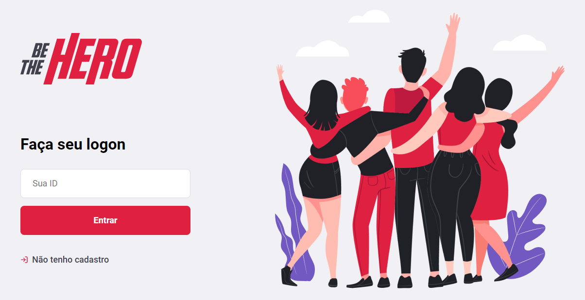

<h1 align="center">
    
</h1>

<h3 align="center" >
  An application where you can be the hero and save the world, but not by the conventional way, but by helping some NGOs to raise funds for their causes
</h3>

  
  
  
  
   

  
  
  
  
  

  <a href="#computer-languages">Languages</a>&nbsp;&nbsp;&nbsp;|&nbsp;&nbsp;&nbsp;
  <a href="#books-technologies">Technologies</a>&nbsp;&nbsp;&nbsp;|&nbsp;&nbsp;&nbsp;
  <a href="#memo-license">License</a>

## :computer: Languages

- **HTML**
- **CSS**
- **Javascript**

## :books: Technologies

* **@react-native-community/masked-view**: 0.1.5
* **@react-navigation/native**: ^5.1.3
* **@react-navigation/stack**: ^5.2.6
* **axios**: ^0.19.2
* **expo**: ~36.0.0
* **expo-constants**: ~8.0.0
* **expo-mail-composer**: ~8.0.0
* **intl**: ^1.2.5
* **react**: ~16.9.0
* **react-dom**: ~16.9.0
* **react-native**: https://github.com/expo/react-native/archive/sdk-36.0.0.tar.gz
* **react-native-gesture-handler**: ~1.5.0
* **react-native-reanimated**: ~1.4.0
* **react-native-safe-area-context**: 0.6.0
* **react-native-screens**: 2.0.0-alpha.12
* **react-native-web**: ~0.11.7

**devDependencies**

* **@babel/core**: ^7.0.0
* **babel-preset-expo**: ~8.0.0

## :memo: License

This project is under MIT. See at here [LICENSE](/LICENSE) for more informations.

---

Made by :blue_heart: by [Arthur Pedroti](https://github.com/ArthurPedroti)
